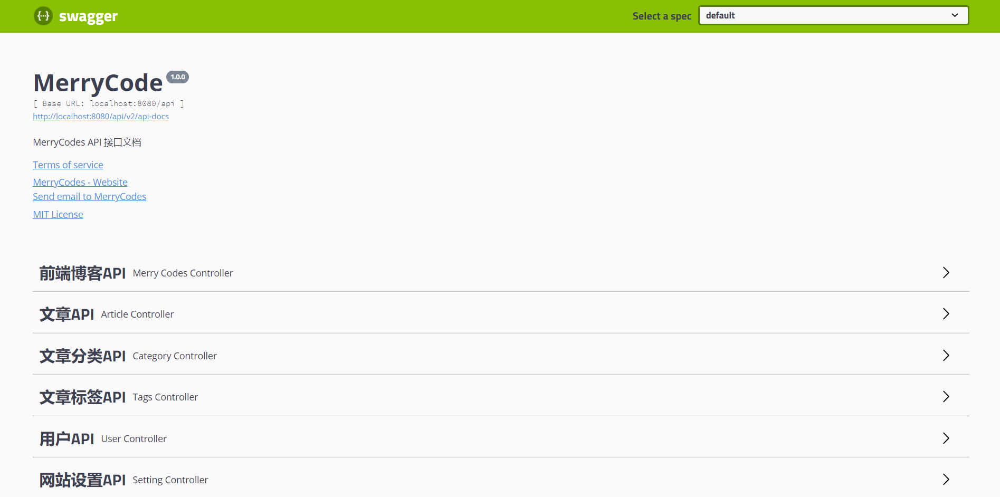
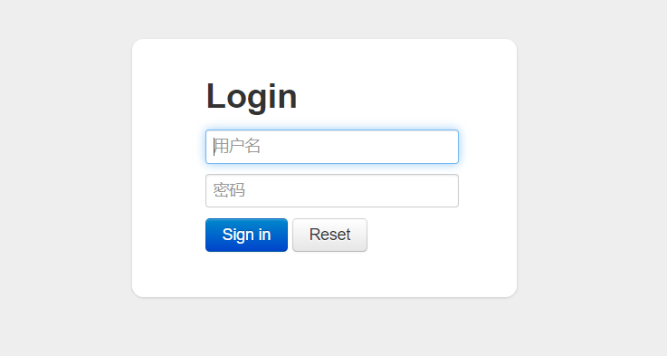
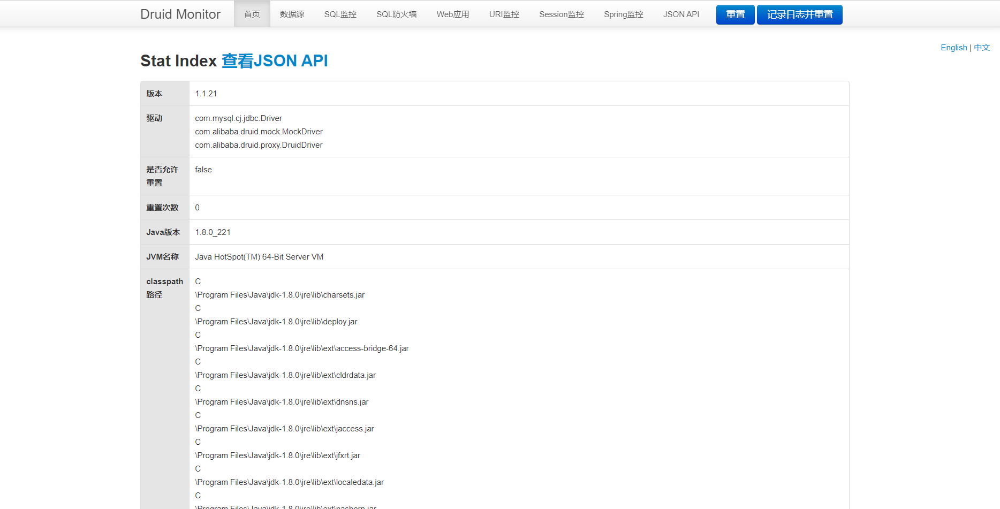
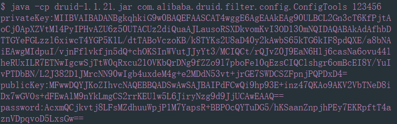
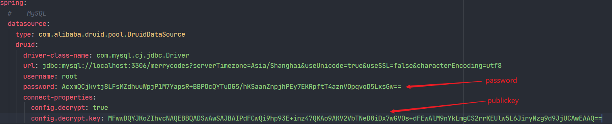

<p align="center">
    
</p>

> ps：图片来源于网络

<p align="center">
    <a href="https://docs.oracle.com/javase/8/docs/#NewFeature">
        
    </a>
    <a href="https://spring.io/projects/spring-boot">
         
    </a>
     <a href="https://spring.io/projects/spring-security">
         
    </a>
    <a href="http://springfox.github.io/springfox">
         
    </a>
    <a href="https://github.com/alibaba/druid">
         
    </a>
    <a href="https://mp.baomidou.com">
         
    </a>
    <a href="https://jwt.io">
        
    </a>
    <a href="https://github.com/merrycodes/merrycodes-serve/blob/master/LICENSE">
        
    </a>
</p>

## 简介

-  [merrycodes](https://github.com/merrycodes/merrycodes-serve) 是个人博客后台，项目后台基于 [SpringBoot](https://spring.io/projects/spring-boot) ，以及使用 [SpringSecurity](https://spring.io/projects/spring-security) 安全框架与 [JWT](https://jwt.io) 来实现用户登录、角色访问控制等功能。
- 演示站点：[博客前端](https://merrycodes.top) 、[后台管理前端](https://admin.merrycodes.top)
- [博客前端项目地址](https://github.com/merrycodes/merrycodes-font) 、[后台管理前端项目地址](https://github.com/merrycodes/merrycodes-admin)
- 演示账号：user 、 演示密码：123456 （请先搭建后台管理前端）

- 项目会持续更新，如果有不完善的地方，欢迎 **[issue](https://github.com/merrycodes/merrycodes-serve/issues/new)** 和 **[pr](https://github.com/merrycodes/merrycodes-serve/compare)**

## 前序准备

你需要在本地准备 `Java8` 及以上的版本 （ `Java8` 以上版本未做测试），项目中使用到了 `Java8 `  中的新特性。本项目技术栈基于 `SpringBoot` 、`SpringSecurity` 、`MyBatis` | `MyBatis Plus`  、`JWT` ，提前了解和学习这些知识对使用该项目有很大的帮助。

## 目录结构

```
.
├─md_img                                         markdown图片
├─sql                                            SQL文件
├─src
│  ├─main
│  │  ├─java.com.merrycodes
│  │  │  ├─config                                配置类
│  │  │  ├─constant
│  │  │  │  ├─consist                            常量定义类
│  │  │  │  └─enums                              枚举定义类
│  │  │  ├─controller                            控制器类
│  │  │  ├─exception                             自定义异常类
│  │  │  ├─filter                                过滤器、拦截器类
│  │  │  ├─handler                               处理器类
│  │  │  ├─mapper                                数据访问层接口类
│  │  │  ├─model
│  │  │  │  ├─entity                             实体类
│  │  │  │  ├─form                               表单类
│  │  │  │  └─vo                                 显示层对象类（返回前端数据类）
│  │  │  ├─service
│  │  │  │  ├─impl                               业务逻辑接口类
│  │  │  │  └─intf                               业务逻辑代码实现类
│  │  │  └─utils                                 工具类
│  │  └─resources
│  │     │  application-dev.yml                  开发环境配置文件
│  │     │  application-prod.yml                 生产环境配置文件
│  │     │  application.yml                      基本配置文件
│  │     │  banner.txt                           自定义banner
│  │     └─mapper                                MyBatis的XML映射文件
│  └─test                                        单元测试
```

## 开发

```bash
# 克隆项目 / GitHub 下载压缩包
git clone https://github.com/merrycodes/merrycodes-serve.git

# 配置运行配置 (application-dev.yml / application-prod.yml) 

# 运行 MerryCodesServeApplication 默认加载开发环境配置文件
```

**程序运行在8080端口，需要配合 [后台管理前端](https://github.com/merrycodes/merrycodes-admin) 使用。**

## 发布

```bash
mvn clean

# install 跳过单元测试
mvn install -Dmaven.test.skip=true
```

## 其他

```bash
# 运行时加载开发环境的配置文件
java -jar -Dspring.profiles.active=prod merrycodes-serve-1.0.0.jar

# Linux 在后台运行
nohup java -jar -Dspring.profiles.active=prod merrycodes-serve-1.0.0.jar &

# Linux 动态查看日志
tail -f nohup.out
```

## Swagger 文档

**浏览器访问：http://localhost:8080/api/swagger-ui.html**

<p align="center">
    
</p>
> Swagger 开发文档只在开发环境开启，查看 **`SwaggerConfig`**

```java
    @Value("${spring.profiles.active}")
    private String profile;

	……

    @Bean
    public Docket restfulApi() {
        return new Docket(DocumentationType.SWAGGER_2)
                .apiInfo(apiInfo())
                .select()
                .apis(RequestHandlerSelectors.basePackage(SWAGGER_SCAN_BASE_PACKAGE))
                .paths(PathSelectors.any())
                .build()
                // 开发环境中生效
                .enable("dev".equals(profile));
    }
```

## Druid 数据库监控

**浏览器访问：http://localhost:8080/api/druid**

> 默认用户名：admin	默认密码：admin

<p align="center">
    
</p>

- 需要修改默认的用户名与密码，请修改 **`application.yml`** 配置文件中的配置：
    - **spring.datasource.druid.stat-view-servlet.login-username**
    - **spring.datasource.druid.stat-view-servlet.login-password**

<p align="center">
    
</p>

> 如果想更多的定制化可以查看官方 **[wiki](https://github.com/alibaba/druid/wiki)** 。

## Druid 数据库加密密码

使用 `Druid` 加密数据库密码需要运行 `Druid` jar包中的 `ConfigTools` 的类，有兴趣的可以看看代码。使用的加密方式是 `RSA` 非对称加密。首先本项目使用 `Maven`  构建，所以到默认的 `Maven` 仓库中查找 `Druid` 的jar包。

```bash
# 生成加密后的密码 123456为数据库明文密码
java -cp druid-1.1.21.jar com.alibaba.druid.filter.config.ConfigTools 123456

# 在当前目录下生成 password.txt 文件，内容为加密后的密码
java -cp druid-1.1.21.jar com.alibaba.druid.filter.config.ConfigTools 123456 > password.txt
```

<p align="center">
    
</p>

配置数据库密码：

<p align="center">
    
</p>

## License

[MIT](https://github.com/merrycodes/merrycodes-serve/blob/master/LICENSE)